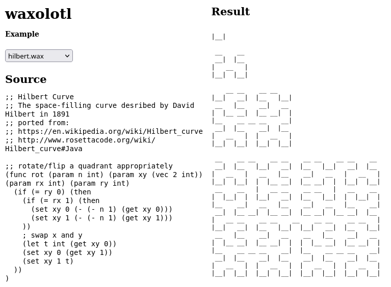

# waxolotl

`waxolotl` is a small language that compiles to WebAssembly Text format. It is a mutant offspring of [wax](https://github.com/LingDong-/wax) and [wat-compiler](https://github.com/stagas/wat-compiler) that builds a standalone WASM binary in the browser or server.

**[Demo](https://eliot-akira.github.io/waxolotl/) · [Source](https://github.com/eliot-akira/waxolotl)**



## Develop

Install

```sh
git clone https://github.com/eliot-akira/waxolotl
npm install
```

Build for development - Watch files for changes and rebuild

```sh
npm run dev
```

Build for production

```sh
npm run build
```

Build WASM - Emscripten targets for web and Node

```sh
npm run build:wasm
```
